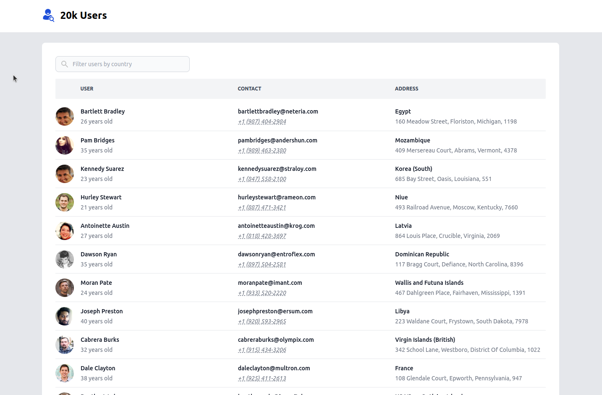

<h3 align="center">20k Users</h3>

Render 20,000 Vue components in a single page without browser freezing or any other performance issues?!

Yes, this is possible in this demo app this is exactly what I did!

 

<h1 align="center">
<a href="https://20k-users-nuxt.netlify.app/">Live Demo</a>
</h1>

# About

This project serves as a testament to my proficiency as both a front-end and full-stack web developer. It demonstrates my expertise in various technologies and showcases my ability to create polished and functional web applications.

You can contact me at [belov.yanko@gmail.com](mailto:belov.yanko@gmail.com).

## Technologies Used

This project was built using the following technologies:

- **Nuxt.js**
- **Vue.js**
- **TypeScript**
- **JavaScript**
- **Node.js**
- **Tailwind**
- **Vite**
- **ESLint**
- **Prettier**
- **StyleLint**
